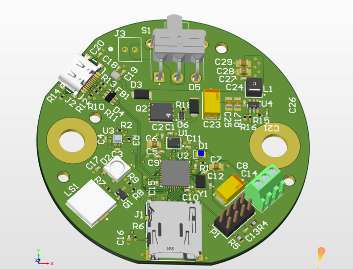
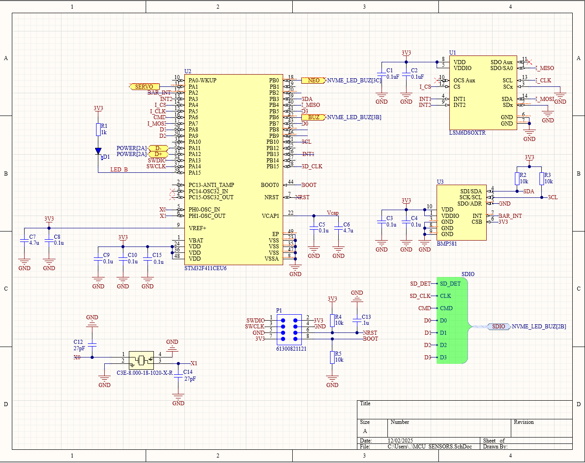
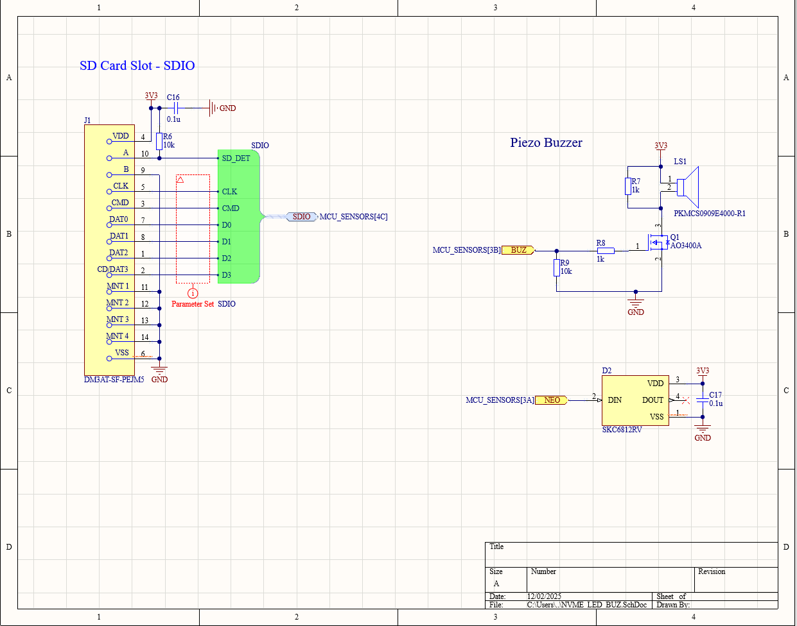

# Airbrakes Controller PCB

## Project Summary

This repository contains the design files for the **Airbrakes Controller PCB** developed for **Pitt SOAR** (Society of Aerospace Rocketry). The controller is designed to fit within a 3-inch diameter rocket and manages the airbrakes system for active flight control and apogee targeting.

The airbrakes controller integrates sensing, computation, and actuation to deploy airbrakes during powered and coast phases of flight, helping the rocket reach a precise target altitude.

---

## Key Features & Hardware Summary

> **Note:** Update the following placeholders with exact part numbers and specifications as the design is finalized.

| Component         | Description / Part Number                          |
|-------------------|----------------------------------------------------|
| **Microcontroller** | _[Placeholder: e.g., STM32F4xx, Teensy 4.x, etc.]_ |
| **Sensors**         | _[Placeholder: IMU, barometer, accelerometer, etc.]_ |
| **Actuators**       | _[Placeholder: servo, stepper motor, etc.]_       |
| **Power**           | _[Placeholder: battery type, voltage regulator, etc.]_ |
| **Connectors**      | _[Placeholder: JST, Molex, screw terminals, etc.]_ |

---

## Assembly & Mounting Notes

- The PCB is designed for integration in a **3-inch diameter rocket** airframe.
- Ensure proper alignment with the airbrakes mechanism and secure mounting to withstand flight loads.
- Double-check connector orientations and secure all wiring harnesses before flight.
- Refer to schematic and 3D render images below for component placement and board layout.

---

## Files & Folders

| Path / File                     | Description                                      |
|---------------------------------|--------------------------------------------------|
| `images/`                       | Folder containing schematic and render images    |
| `images/pcb_3d_render.png`      | 3D render of the assembled PCB                   |
| `images/schematic_page_1.png`   | Schematic diagram (Page 1)                       |
| `images/schematic_page_2.png`   | Schematic diagram (Page 2)                       |
| `images/schematic_page_3.png`   | Schematic diagram (Page 3)                       |

---

## Images Included

The following images are included in the `images/` folder for reference:

### PCB 3D Render

*3D render of the Airbrakes Controller PCB showing component placement and board layout.*

### Schematic Page 1

*Schematic diagram – Page 1.*

### Schematic Page 2

*Schematic diagram – Page 2.*

### Schematic Page 3

*Schematic diagram – Page 3.*

> **Note:** The repository originally contained four images at the root (`image.png`, `image copy.png`, `image copy 2.png`, `image copy 3.png`). These have been reorganized into the `images/` folder with descriptive names. Reviewers should verify that the mapping of schematic pages vs. the 3D render is correct and update as needed.

---

## Usage

1. Review the schematic diagrams to understand the circuit design.
2. Use the 3D render to verify component placement and board dimensions.
3. Fabricate the PCB using the design files (if available) or order from a PCB manufacturer.
4. Assemble components per the schematic and test before integration.
5. Integrate into the rocket airframe and connect to the airbrakes mechanism.

---

## Contributing

Contributions are welcome! If you'd like to contribute:

1. Fork this repository.
2. Create a feature branch (`git checkout -b feature/your-feature`).
3. Commit your changes (`git commit -m 'Add your feature'`).
4. Push to the branch (`git push origin feature/your-feature`).
5. Open a Pull Request.

Please ensure all changes are tested and documented.

---

## Safety & Disclaimer

- **This project involves high-power rocketry.** Always follow NAR, TRA, or local regulations.
- Ensure proper safety reviews and testing before any flight.
- The authors are not responsible for any damage, injury, or regulatory violations resulting from the use of this design.
- Use at your own risk.

---

## License

> **Suggestion:** Add an appropriate open-source license (e.g., MIT, Apache 2.0, GPL) to clarify usage rights.

_No license has been specified yet. Please add a LICENSE file to this repository._

---

## Changelog

| Version | Date       | Description                                      |
|---------|------------|--------------------------------------------------|
| 1.0     | TBD        | Initial release of the Airbrakes Controller PCB  |

---

## Authors & Contacts

- **Pitt SOAR** – [Website or Contact Info Placeholder]
- For questions or contributions, please open an issue or pull request in this repository.

---

*This README was created to document the Airbrakes Controller PCB project for Pitt SOAR. Please update hardware details and contact information as the project evolves.*