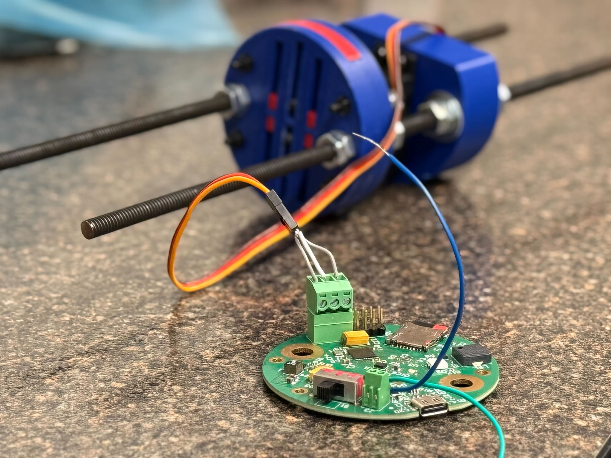
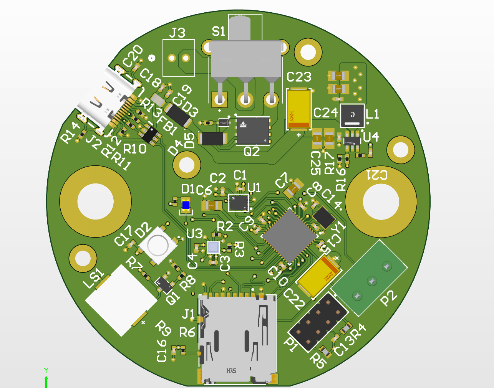

# Airbrakes Controller PCB

---

## Project Summary

The Airbrakes Controller PCB is the flight computer for the active drag system on Pitt SOAR's competition rocket. Designed to fit within a **3-inch diameter airframe**, it manages real-time sensor fusion, flight state estimation, and servo actuation to deploy airbrakes during coast phase — enabling precision apogee targeting.

---

## Hardware Specifications

| Component | Part | Notes |
|-----------|------|-------|
| Microcontroller | STM32F411CEU6 | ARM Cortex-M4, 100 MHz |
| Barometric Pressure | BMP581 | Altitude estimation |
| IMU | LSM6DSOX | 6-DOF accel/gyro |
| Data Logging | SDIO (microSD) | Flight data recording |
| Servo Control | Hardware PWM timer | Airbrake actuation |
| Status Indication | WS2812B NeoPixel | RGB status LED |
| Form Factor | 4-layer PCB | ~3" diameter constraint |

---

## Assembly & Mounting Notes

- Designed for integration in a **3-inch diameter rocket airframe**
- Ensure proper alignment with the airbrakes mechanism and secure mounting to withstand flight loads
- Double-check connector orientations and secure all wiring harnesses before flight
- Refer to schematic and 3D render images in the `images/` folder for component placement and board layout

---

## Images

### Action Shot


### Top-Down PCB View


---

## Usage

1. Review the schematic diagrams to understand the circuit design
2. Use the 3D render to verify component placement and board dimensions
3. Fabricate the PCB using the provided design files or order from a PCB manufacturer
4. Assemble components per the schematic and bench-test all peripherals before integration
5. Flash firmware and verify sensor output over serial before flight
6. Integrate into the rocket airframe and connect to the airbrakes mechanism

---

## Sponsors

[](https://www.pcbway.com)

This project was sponsored by **[PCBway](https://www.pcbway.com)**, who provided PCB fabrication support. PCBway offers high-quality PCB manufacturing and assembly services for engineers, students, and hobbyists worldwide. We greatly appreciate their support of university rocketry programs.

---

## Safety & Disclaimer

- This project involves **high-power rocketry**. Always follow [NAR](https://www.nar.org), [TRA](https://www.tripoli.org), and all applicable local regulations
- Ensure proper safety reviews and full system testing before any flight
- The authors are not responsible for any damage, injury, or regulatory violations resulting from the use of this design
- **Use at your own risk**

---

## License

This project is licensed under the **MIT License**. See [`LICENSE`](LICENSE) for full terms.

```
MIT License

Copyright (c) 2025 Pitt SOAR – Society of Aerospace Rocketry

Permission is hereby granted, free of charge, to any person obtaining a copy
of this software and associated documentation files (the "Software"), to deal
in the Software without restriction, including without limitation the rights
to use, copy, modify, merge, publish, distribute, sublicense, and/or sell
copies of the Software, and to permit persons to whom the Software is
furnished to do so, subject to the following conditions:

The above copyright notice and this permission notice shall be included in all
copies or substantial portions of the Software.

THE SOFTWARE IS PROVIDED "AS IS", WITHOUT WARRANTY OF ANY KIND, EXPRESS OR
IMPLIED, INCLUDING BUT NOT LIMITED TO THE WARRANTIES OF MERCHANTABILITY,
FITNESS FOR A PARTICULAR PURPOSE AND NONINFRINGEMENT. IN NO EVENT SHALL THE
AUTHORS OR COPYRIGHT HOLDERS BE LIABLE FOR ANY CLAIM, DAMAGES OR OTHER
LIABILITY, WHETHER IN AN ACTION OF CONTRACT, TORT OR OTHERWISE, ARISING FROM,
OUT OF OR IN CONNECTION WITH THE SOFTWARE OR THE USE OR OTHER DEALINGS IN THE
SOFTWARE.
```

---

## Changelog

| Version | Date | Description |
|---------|------|-------------|
| 1.0 | TBD | Initial release of the Airbrakes Controller PCB |

---

## Authors & Contact

**Pitt SOAR – Society of Aerospace Rocketry**
University of Pittsburgh

- 🔗 LinkedIn: [Pittsburgh SOAR](https://www.linkedin.com/company/pittsburgh-soar)
